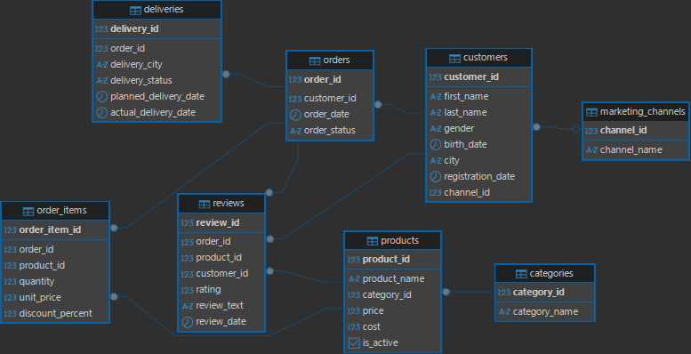

# E-commerce SQL Analytics

## Краткое описание

**E-commerce SQL Analytics** — SQL pet-project по проектированию аналитической базы данных интернет-магазина в PostgreSQL. Проект включает DDL/DML-скрипты, справочники, генерацию синтетических данных, индексы, представления, функции, процедуры, аналитические запросы и проверки качества данных.

Проект имитирует рабочий кейс data analyst / business analyst: от проектирования структуры БД до подготовки аналитических отчетов по продажам, клиентам, товарам, маркетинговым каналам, доставкам и data quality.

## Цель проекта

Спроектировать и реализовать аналитическую базу данных интернет-магазина, наполнить ее тестовыми данными и показать, какие бизнес-вопросы можно решать с помощью SQL в PostgreSQL.

## Бизнес-контекст

Интернет-магазин продает товары разных категорий и привлекает клиентов из нескольких маркетинговых каналов. Бизнесу нужно понимать:

- как меняются выручка, прибыль и средний чек;
- какие товары и категории формируют основную выручку;
- какие клиенты совершают повторные покупки;
- какие каналы привлечения дают больше заказов и выручки;
- насколько качественно работает доставка;
- есть ли проблемы в данных, которые могут исказить аналитику.

## Стек технологий

- PostgreSQL
- SQL
- PL/pgSQL
- DBeaver
- psql
- Markdown
- ERD через DBeaver или Draw.io

## Структура проекта

```text
ecommerce-sql-analytics/
├── README.md
├── docs/
│   ├── 01_project_description.md
│   ├── 02_conceptual_model.md
│   ├── 03_logical_model.md
│   ├── 04_physical_model.md
│   ├── 05_data_dictionary.md
│   └── er_diagram.png
├── sql/
│   ├── 01_create_tables.sql
│   ├── 02_insert_reference_data.sql
│   ├── 03_generate_test_data.sql
│   ├── 04_indexes.sql
│   ├── 05_views.sql
│   ├── 06_functions.sql
│   ├── 07_procedures.sql
│   ├── 08_analytics_queries.sql
│   └── 09_data_quality_checks.sql
└── results/
    ├── 01_sales_analysis.md
    ├── 02_customer_analysis.md
    ├── 03_product_analysis.md
    ├── 04_marketing_channels_analysis.md
    ├── 05_delivery_analysis.md
    └── final_business_report.md
```

Если файла `docs/er_diagram.png` нет, ER-диаграмму можно экспортировать из DBeaver после создания таблиц и положить в папку `docs`.

## Схема данных

База данных содержит 9 основных таблиц:

| Таблица | Назначение |
|---|---|
| `marketing_channels` | Каналы привлечения клиентов |
| `customers` | Клиенты интернет-магазина |
| `categories` | Категории товаров |
| `products` | Товарный каталог |
| `orders` | Заказы клиентов |
| `order_items` | Состав заказов |
| `payments` | Оплаты заказов |
| `deliveries` | Доставки заказов |
| `reviews` | Отзывы клиентов |

Ключевая сущность модели — `orders`. Через нее связываются клиенты, товары, оплаты, доставки и отзывы. Связь между заказами и товарами реализована через таблицу `order_items`, так как один заказ может содержать несколько товаров, а один товар может встречаться во многих заказах.

## ER-диаграмма



## Как развернуть проект локально

### Вариант 1: через DBeaver

1. Установите PostgreSQL и DBeaver.
2. Создайте локальную базу данных, например `ecommerce_sql_analytics`.
3. Подключитесь к базе в DBeaver.
4. Откройте SQL-скрипты из папки `sql`.
5. Запустите скрипты по порядку из раздела ниже.
6. После выполнения скриптов откройте аналитические запросы и проверки качества данных.
7. При необходимости экспортируйте ER-диаграмму: правый клик по схеме в DBeaver -> ER Diagram -> Export -> `docs/er_diagram.png`.

### Вариант 2: через psql

```bash
createdb ecommerce_sql_analytics
psql -d ecommerce_sql_analytics -f sql/01_create_tables.sql
psql -d ecommerce_sql_analytics -f sql/02_insert_reference_data.sql
psql -d ecommerce_sql_analytics -f sql/03_generate_test_data.sql
psql -d ecommerce_sql_analytics -f sql/04_indexes.sql
psql -d ecommerce_sql_analytics -f sql/05_views.sql
psql -d ecommerce_sql_analytics -f sql/06_functions.sql
psql -d ecommerce_sql_analytics -f sql/07_procedures.sql
psql -d ecommerce_sql_analytics -f sql/08_analytics_queries.sql
psql -d ecommerce_sql_analytics -f sql/09_data_quality_checks.sql
```

## Порядок запуска SQL-скриптов

1. `sql/01_create_tables.sql`
2. `sql/02_insert_reference_data.sql`
3. `sql/03_generate_test_data.sql`
4. `sql/04_indexes.sql`
5. `sql/05_views.sql`
6. `sql/06_functions.sql`
7. `sql/07_procedures.sql`
8. `sql/08_analytics_queries.sql`
9. `sql/09_data_quality_checks.sql`

## Основные аналитические вопросы

- Какова общая выручка, валовая прибыль и маржинальность?
- Как меняется выручка по месяцам?
- Какой средний чек по месяцам?
- Какие товары и категории приносят больше всего выручки?
- Какие товары входят в группы A, B и C по ABC-анализу?
- Какие каналы привлечения дают больше клиентов, заказов и выручки?
- Какая доля клиентов делает повторные покупки?
- Какие клиентские сегменты выделяются по RFM?
- Какие города формируют наибольшую выручку?
- Какая доля доставок выполняется вовремя?
- Есть ли связь между задержками доставки и негативными отзывами?
- Какие проблемы качества данных нужно исправить перед анализом?

## Ключевые SQL-файлы

| Файл | Назначение |
|---|---|
| `01_create_tables.sql` | Создание таблиц, первичных и внешних ключей, ограничений |
| `02_insert_reference_data.sql` | Загрузка справочников каналов и категорий |
| `03_generate_test_data.sql` | Генерация синтетических данных |
| `04_indexes.sql` | Индексы для ускорения аналитических запросов |
| `05_views.sql` | Аналитические представления |
| `06_functions.sql` | Функции расчета выручки, прибыли, сегмента клиента и результата доставки |
| `07_procedures.sql` | Хранимые процедуры для изменения статусов и создания заказа |
| `08_analytics_queries.sql` | SQL-запросы для бизнес-анализа |
| `09_data_quality_checks.sql` | Проверки качества и согласованности данных |

## Основные метрики

- `revenue` — выручка с учетом скидки;
- `total_cost` — себестоимость проданных товаров;
- `gross_profit` — валовая прибыль;
- `gross_margin_percent` — валовая маржа;
- `average_order_value` — средний чек;
- `revenue_per_customer` — выручка на клиента;
- `repeat_purchase_rate` — доля клиентов с повторными покупками;
- `recency`, `frequency`, `monetary` — показатели RFM-сегментации;
- `ABC group` — группа товара по накопительной доле выручки;
- `delivery_delay` — задержка доставки;
- `average_rating` — средний рейтинг товара.

## Результаты анализа

Отчеты находятся в папке `results`:

- `01_sales_analysis.md` — продажи, выручка, прибыль, средний чек;
- `02_customer_analysis.md` — клиенты, повторные покупки, RFM;
- `03_product_analysis.md` — товары, категории, ABC-анализ, рейтинги;
- `04_marketing_channels_analysis.md` — каналы привлечения;
- `05_delivery_analysis.md` — доставка и клиентский опыт;
- `final_business_report.md` — итоговый бизнес-отчет.

Фактические значения метрик рассчитаны с помощью запросов из `sql/08_analytics_queries.sql` и отражены в отчетах папки `results`

## Проверки качества данных

Файл `sql/09_data_quality_checks.sql` покрывает проверки:

- заказы без состава;
- заказы без оплаты;
- заказы без доставки;
- некорректные цены, себестоимость и скидки;
- доставки с фактической датой раньше даты заказа;
- доставленные заказы без успешной оплаты;
- отзывы по недоставленным или возвращенным заказам;
- клиенты без заказов;
- дублирующиеся названия товаров;
- количество строк в основных таблицах;
- согласованность статусов заказа, оплаты и доставки.

## Что демонстрирует проект

Проект показывает навыки:

- проектирование реляционной модели данных;
- PostgreSQL DDL и DML;
- работа с первичными и внешними ключами;
- ограничения `CHECK`, `UNIQUE`, `NOT NULL`;
- создание индексов;
- построение аналитических представлений;
- PL/pgSQL функции и процедуры;
- CTE;
- оконные функции;
- RFM-сегментация клиентов;
- ABC-анализ товаров;
- расчет бизнес-метрик;
- data quality checks;
- оформление результатов анализа для бизнеса.
